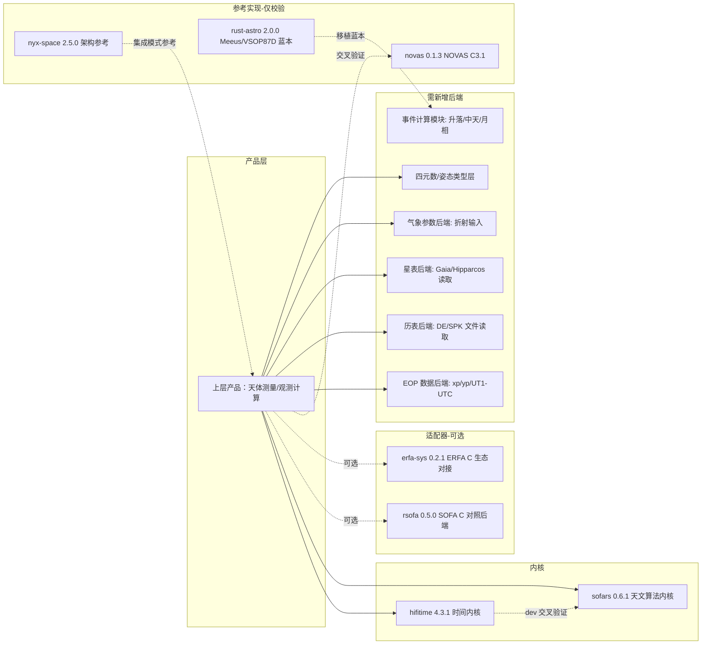

# 七个 Rust 天文库技术调研报告（LIBRARY_RESEARCH）

## 0. 文档信息

- 调研对象（固定映射，与任务契约一致）：
  - `ref/sofars` = [astro-xao/sofars](https://github.com/astro-xao/sofars)
  - `ref/rsofa` = [duncaneddy/rsofa](https://github.com/duncaneddy/rsofa)
  - `ref/erfa-sys` = [cjordan/rust-erfa](https://github.com/cjordan/rust-erfa)（该仓库含 `erfa-sys` 与 `erfa` 两个 crate）
  - `ref/hifitime` = [nyx-space/hifitime](https://github.com/nyx-space/hifitime)
  - `ref/nyx-space` = [nyx-space/nyx](https://github.com/nyx-space/nyx)
  - `ref/rust-astro` = [saurvs/astro-rust](https://github.com/saurvs/astro-rust)（crate 名为 `astro`；此为本任务给定的映射假设，已在第 3.6 节标注）
  - `ref/novas` = [Mubelotix/novas](https://github.com/Mubelotix/novas)
- 调研时间：2026-08-05。所有 HEAD 均为本地 `ref/` 目录实际检出的提交，commit SHA 不可变，可作为指定 permalink 引用。
- 方法与契约遵守：仅使用一手资料（本地克隆源码、Cargo 元数据、仓库内 README/LICENSE/CHANGELOG、捆绑的上游 C 源码与官方 PDF 指南）；按任务约定跳过格式化、lint、构建与测试（未运行任何 cargo 命令）；未修改 `ref/` 下任何仓库文件；唯一交付文件为 `docs/LIBRARY_RESEARCH.md`。
- 标注约定：`[观察]` = 直接从源码/元数据/文档读取的事实；`[推断]` = 基于观察的推理（未直接证实）。每个关键判断均给出可点击的 GitHub commit permalink 或精确本地路径（`ref/<repo>/<path>:<行号>`）。
- 上层产品需求来源：`docs/PRD.md`（调研期间由主代理并行产出，2026-08-05）；本报告第 4 节矩阵的 13 个功能域与 PRD 第 6.1-6.8 节一一对应（6.1 角度/向量/矩阵/四元数/球面、6.2 时间系统、6.3 地球定向与参考系、6.4 星表与天体测量、6.5 观测者与大地测量、6.6 折射、6.7 历表、6.8 球面天文事件）。
- 计数方法说明：第 3.1 节的函数覆盖对比，是用 `ref/rsofa/extern/sofa.h` 中的全部 `iau*` 函数原型（247 个）与 `ref/sofars/src` 中的全部 `pub fn` 名称（231 个）做名称规范化对比（去掉 `iau` 前缀并小写首字母），并对差集逐项 grep 复核后得出；该对比仅按函数名进行，个别函数如以不同命名实现则会被计入缺口，已对全部 17 个缺项逐一抽查确认无同名实现。

## 1. 版本快照总表

| 仓库（ref/ 目录） | 远端 | HEAD 提交 | HEAD 日期 | crate / 版本 | 许可 | MSRV | no_std | FFI / unsafe | features |
|---|---|---|---|---|---|---|---|---|---|
| sofars | github.com/astro-xao/sofars | `c049d4718873f987a8ed1db43740bc04ac97f61b` | 2026-05-07 | sofars 0.6.1 | MIT + SOFA 许可条款 | 1.85+（edition 2024） | 否 | 否 / 0 处 unsafe（纯 Rust） | 无 |
| rsofa | github.com/duncaneddy/rsofa | `d9f71b7084acbd65ab88443dc1614c7d582e312a` | 2023-12-21 | rsofa 0.5.0 | MIT + SOFA 许可条款 | 无声明（edition 2018） | 否 | 是（bindgen+cc 构建期编译 SOFA C）/ 全部调用为裸 unsafe | 无 |
| erfa-sys（仓库 rust-erfa） | github.com/cjordan/rust-erfa | `894ba1fa0bcb87fada7c7cb014cbda40a500c5d2` | 2022-11-23 | erfa-sys 0.2.1、erfa（纯 Rust 移植） | MPL-2.0（crate 层）+ ERFA 许可（C 源，BSD-3 类条款） | 无声明（edition 2021） | 否 | 是（`links="erfa"`，pkg-config 或 static 子模块）/ 21 处 unsafe（sys 层） | `static`（需检出子模块，当前未检出） |
| hifitime | github.com/nyx-space/hifitime | `9ec8523dad8c45f14f97835655d5395c773f9cd1` | 2026-08-02 | hifitime 4.3.1 | MPL-2.0 | CI 以 1.85 为 MSRV；manifest 无 rust-version | 是（`#![cfg_attr(not(feature = "std"), no_std)]`） | 否 / 0 处 unsafe | `default=["std"]`；`std`/`python`/`ut1`/`lts` |
| nyx-space | github.com/nyx-space/nyx | `ac2de9be8dad5d5667fd3c108d1187e4b26b294b` | 2026-08-02 | nyx-space 2.5.0（nyx-core + nyx-py） | AGPL-3.0-or-later + `premium` 双许可 | 无声明（edition 2024） | 否 | 否 / 8 处 unsafe | `default=["premium"]`；`python` |
| rust-astro（映射假设） | github.com/saurvs/astro-rust | `c62ffdc7d55adfa1ee835fc7006d42d967bc4836` | 2018-07-06 | astro 2.0.0 | MIT | 无声明（edition 2015） | 否 | 否 / 0 处 unsafe | 无 |
| novas | github.com/Mubelotix/novas | `0eed07e56a0f97786c0c936d5ed3e2ac9f25d3f1` | 2026-04-25 | novas 0.1.3 | 不一致：Cargo.toml=MIT、README=GPLv3-only、仓库无 LICENSE 文件、NOVAS 上游"无许可要求" | 无声明（edition 2021） | 否 | 是（`links="novas_c31"`，bindgen+cc 编译捆绑 NOVAS C3.1）/ 7 处 unsafe | `default=["embedded-cio-ra"]` |

版本快照证据（本地路径）：各仓库 `Cargo.toml` 的 `version` 字段与 `git log -1`、`git describe --tags` 输出一致；具体行号在各节引用中给出。

## 2. SOFA / ERFA 衍生关系与版权许可事实核查

### 2.1 SOFA（IAU Standards of Fundamental Astronomy）

[观察] SOFA 由 IAU SOFA Board 拥有并维护，其许可文本（"SOFA Software License"）被完整收录在 `ref/sofars/LICENSE` 与 `ref/rsofa/LICENSE` 中（两仓库均在 MIT 文本之后附上 SOFA 六条许可条款）。许可要点（依据 `ref/sofars/LICENSE` 中的原文）：

1. 软件所有权归 IAU SOFA Board；任何目的（含商业）免费使用，无需支付版税。
2. 允许复制、分发、改编 SOFA 源码与算法；"derived work"（非完整未改动副本）必须：(a) 声明其使用了由 SOFA 提供、经许可派生的例程，且自身不构成 SOFA 提供或背书的软件；(b) 派生源码须描述基于/包含/区别于原版 SOFA 之处；(c) 派生作品中的例程名不得含 `iau` 或 `sofa` 前缀（含大小写变体）；(d) 不得歪曲来源、不得声称编写了原版软件、不得就 SOFA 软件或内嵌算法申请专利；(e) 上述要求须在再分发中完整保留。
3. 原始 SOFA 分发意图是 IAU 标准的权威实现，第三方修改被劝阻；所有变体（无论多小）须显式标注。
4. 不得以滥用或不当方式使 SOFA 软件声誉受损；软件 "as is" 提供、无担保；鼓励在出版物与商业产品中致谢（www.iausofa.org）。

### 2.2 ERFA（Essential Routines for Fundamental Astronomy）

[观察] `ref/erfa-sys/LICENSE-ERFA`（NumFOCUS Foundation 版权，2013-2014）原文声明：

- "This library is derived, with permission, from the International Astronomical Union's 'Standards of Fundamental Astronomy' library"（经许可从 IAU SOFA 库派生）。
- "The ERFA version is intended to retain identical functionality to the SOFA library, but made distinct through different function and file names, as set out in the SOFA license conditions"（以不同函数名与文件名与 SOFA 区分，即 `era_` 前缀）。
- 与 SOFA 的关键差异："The SOFA original has a role as a reference standard for the IAU and IERS, and consequently redistribution is permitted only in its unaltered state. The ERFA version is not subject to this restriction"（ERFA 允许修改后重新分发）；"any [bugs] that are discovered will be fixed"（发现 SOFA 中的 bug 会在 ERFA 中修复）。
- 再分发条款为 BSD-3 风格：保留版权声明、二进制须附声明、不得以 SOFA Board/IAU/贡献者名义背书、无担保。

### 2.3 衍生链与命名合规

[观察] 衍生链：IAU SOFA C（iausofa.org）→ ERFA C（[liberfa/erfa](https://github.com/liberfa/erfa)，`era_` 前缀，可修改再分发）→ `erfa-sys`（bindgen 绑定 + 链接）与 `erfa`（纯 Rust 移植）。`sofars` 直接从 SOFA C 移植为纯 Rust，按模块组织并去掉 `iau` 前缀（如 `iauS06` 变为 `pnp::s06`），符合 SOFA 许可第 3(c) 条对派生作品命名的要求。`rsofa` 分发的是未改动的 SOFA C 源码（`ref/rsofa/extern/src`，248 个 .c 文件）外加自动生成的绑定，属于许可允许的 "intact and unchanged copies" 分发，故保留 `iau*` 原生函数名。`sofars` 源码头注释明确标注对照版本为 "SOFA release 2023-10-11"（例：`ref/sofars/src/pnp/bi00.rs:48`、`ref/sofars/src/astro/aticq.rs:66`），与 `rsofa` 捆绑的 SOFA 版本（2023-10-11，`ref/rsofa/extern/sofa.h` 头注释）一致。

### 2.4 novas 许可状态核查（重要不一致）

[观察] `ref/novas/Cargo.toml:5` 声明 `license = "MIT"`；`ref/novas/README.md` 末行（第 66 行）声明 "License: GPLv3-only"；仓库根目录不存在 LICENSE 文件；而捆绑的 NOVAS C3.1 官方 `README.txt`（`ref/novas/novasc3.1/README.txt:44`）原文为 "NOVAS has no licensing requirements. If you use NOVAS in an application, an acknowledgement of the Astronomical Applications Department of the U.S. Naval Observatory would be appropriate." 三处声明不一致：上游算法无许可要求（近似公有领域使用），Rust 包装层的许可在 MIT 与 GPLv3-only 之间互相矛盾。此为接入前必须澄清的法律风险点（见第 7.4 节）。

### 2.5 其余库许可

[观察] `hifitime` 为 MPL-2.0（`ref/hifitime/LICENSE.txt`）；`nyx-space` 为 AGPL-3.0-or-later（`ref/nyx-space/Cargo.toml:16`，LICENSE 文件为 AGPLv3 全文），且 `premium` 特性为双许可（见 3.5）；`rust-astro` 为 MIT（`ref/rust-astro/LICENSE.md`）；`erfa`/`erfa-sys` crate 为 MPL-2.0（`ref/erfa-sys/erfa-sys/Cargo.toml` 与 `ref/erfa-sys/erfa/Cargo.toml`）。

### 2.6 许可兼容性结论

- SOFA 派生（sofars、rsofa）可用于商业闭源产品，但必须满足：派生源码中说明差异（两仓库均已在其 LICENSE 中附 SOFA 条款并在 README 声明）、函数名不含 `iau`/`sofa` 前缀（sofars 满足；rsofa 因分发未改动 SOFA C 而例外）、出版物致谢。
- ERFA 派生（erfa-sys/erfa）无"未改动分发"限制，BSD-3 条款更宽松。
- hifitime（MPL-2.0）与 rust-astro（MIT）无传染性约束。
- nyx-space 的 AGPL + `premium` 收入门槛限制（默认开启 `premium`）对商业产品是硬性约束。
- novas 的 Rust 包装层许可不明（MIT 与 GPLv3-only 冲突），需在接入前与作者确认。

## 3. 逐库分析

### 3.1 sofars（astro-xao/sofars）—— 纯 Rust 的 SOFA 移植

**身份与版本**：[观察] HEAD `c049d4718873f987a8ed1db43740bc04ac97f61b`（2026-05-07，`docs: Update sofars dependency version in README-zh.md`）；crate `sofars` 0.6.1（`ref/sofars/Cargo.toml:5`）；edition 2024（`ref/sofars/Cargo.toml:6`）；许可 MIT + SOFA 条款（`ref/sofars/LICENSE` 含 SOFA 许可全文）。仓库描述 "Pure Rust implementation of the IAU SOFA library"（`ref/sofars/Cargo.toml` description 字段）。

**维护状态**：[观察] 活跃。CHANGELOG（`ref/sofars/CHANGELOG.md`）显示 2025-03-19 的 0.1.0 到 2026-04-17 的 0.6.1 期间持续发布；有 release-plz 自动发布工作流（`.github/workflows/release-plz.yml`）；0.6.0 新增 gnomonic projection、黄道/银道/大地坐标转换、pv-vector 工具；0.5.0 完成 pnp 模块 64 个例程并注册全部 CIP/CEO 级数。

**Rust 工程属性**：[观察] 纯 Rust，`ref/sofars/src` 中 0 处 `unsafe`；无任何 Cargo features；唯一依赖为 dev-dependency criterion（`ref/sofars/Cargo.toml:14`）；MSRV 1.85+（README 徽章 `ref/sofars/README.md:7`，edition 2024 隐含 1.85）。无 no_std 支持。

**公开模块与核心类型**：[观察] 12 个模块（`ref/sofars/src/lib.rs:209-220`）：`astro`（基本天体测量）、`cal`（历法）、`consts`（SOFA 常数，`ref/sofars/src/consts.rs` 含 DPI/D2PI/DR2D/DD2R/DAS2R/DR2AS 等）、`coords`（坐标转换）、`eph`（历表）、`erst`（地球自转/恒星时）、`fundargs`（IAU 2000/2006 基本角）、`projection`（切平面投影）、`pnp`（岁差/章动/极移）、`star`（FK4/FK5 星表转换）、`ts`（时间尺度）、`vm`（向量矩阵）。核心类型：`IauAstrom`、`IauLdBody`（`ref/sofars/src/astro/mod.rs:57` 有 `IauLdBody::new` 构造）。API 风格与 SOFA C 一致：函数式、双精度双数表示儒略日（如 `era00(tt1, tt2)`），无 Epoch 类型。

**算法域覆盖**：[观察] 对照 SOFA C 2023-10-11（`ref/rsofa/extern/sofa.h` 中 247 个 `iau*` 原型），sofars 实现了 230/247（按规范化函数名对比）。缺 17 个，全部集中在 `vm` 与 `ts` 工具域：`cpv`（拷贝 pv 向量）、`p2pv`、`p2s`、`pap`、`pas`、`pv2p`、`pvdpv`、`pvm`（pv 模长）、`pvup`、`pvxpv`、`rm2v`（旋转矩阵到旋转向量）、`s2p`、`s2xpv`、`sxpv`、`zpv`、`zr`、`tf2d`（时分秒到日小数）。已抽查确认这些名字在 `ref/sofars/src` 中无同名实现。其余 230 个覆盖：时间尺度（`ts` 21 个函数，含 `dat` 闰秒、`dtdb`、`dtf2d`、`d2dtf`、UTC/TAI/TT/TDB/TCG/TCB/UT1 全对转换）、地球定向（`erst`：`era00`/`gmst00`/`gmst06`/`gmst82`/`gst00a`/`gst00b`/`gst06`/`gst06a`/`gst94`/`ee00`/`ee00a`/`ee00b`/`ee06a`/`eect00`/`eqeq94`）、岁差章动极移（`pnp` 64 例程：`bp00`/`bp06`/`c2i*`/`c2t*`/`num00a`/`nut00a`/`nut00b`/`nut06a`/`nut80`/`pnm00a`/`pom00`/`xy06`/`xys00a`/`xys06a` 等）、基本角（`fundargs` 14 个）、坐标转换（`coords`：`icrs2g`/`g2icrs`/`eceq06`/`eqec06`/`ecm06`/`lteceq`/`ltecm`/`lteqec`/`eform`/`gc2gd`/`gd2gc`/`ae2hd`/`hd2ae`/`hd2pa`）、星表（`star`：`fk425`/`fk45z`/`fk524`/`fk52h`/`fk54z`/`fk5hip`/`fk5hz`/`h2fk5`/`hfk5z`）、天体测量（`astro`：`atci13`/`atciq`/`atciqn`/`atco13`/`atio13`/`atoc13`/`atoi13`/`apci`/`apco`/`ab`/`ld`/`ldn`/`ldsun`/`pmpx`/`pmsafe`/`starpv`/`pvstar`/`pvtob`/`refco` 等）、投影（`projection`：`tpors`/`tporv`/`tpsts`/`tpstv`/`tpxes`/`tpxev`）、历表（`eph`：`epv00`（地球，153 KB 系数内嵌）、`moon98`（月球）、`plan94`（冥王星））、历法（`cal`：`cal2jd`/`jd2cal`/`jdcalf`/`epb`/`epb2jd`/`epj`/`epj2jd`）、向量矩阵（`vm` 38 个，含 `a2af`/`a2tf`/`af2a`/`tf2a` 角度格式化与全套旋转矩阵）。

**时间尺度转换细节**：[观察] `sofars::ts` 对不同尺度关系保持了 SOFA 的参数边界，而不是提供一个无条件的万能转换器：

- `taitt`/`tttai` 只应用精确常数 `TT−TAI = 32.184 s`（`src/ts/taitt.rs`、`src/ts/tttai.rs`）。
- `tttcg`/`tcgtt` 使用 `L_G = 6.969290134e-10` 和 1977-01-01 参考历元实现 IAU 定义的 TT↔TCG 线性变换（`src/ts/tttcg.rs`、`src/ts/tcgtt.rs`）。
- `tdbtcb`/`tcbtdb` 使用 `L_B = 1.550519768e-8`、`TDB0 = -6.55e-5 s` 和同一参考历元实现 IAU 2006 TDB↔TCB 线性变换（`src/ts/tdbtcb.rs`、`src/ts/tcbtdb.rs`）。
- `tttdb`/`tdbtt` **不计算模型**，只应用调用者提供的 `dtr = TDB−TT` 秒数。`dtdb(date1, date2, ut, elong, u, v)` 才提供 Fairhead–Bretagnon 完整地心级数加 Moyer/Murray 站心近似；它需要 TDB/TT 日期、UT1 日小数、经度及观测者相对地轴/赤道面的距离。上游文档给出的 1950–2050 绝对精度为相对 DE405 数值积分优于约 ±3 ns；最终高精度关系仍应由太阳系历表数值积分决定（`src/ts/dtdb.rs`）。
- UTC↔TAI/UT1 路径调用 `ts::dat` 的 SOFA 内嵌 UTC 历史。该数据策略与 hyastro 的版本化 `LeapSeconds` 不同，因此只适合作为对照，不得接管 hyastro 的 UTC 标签语义。

**数据依赖**：[观察] 无运行时数据文件；所有级数系数与闰秒表（`ts/dat.rs`）内嵌在源码中。历表只覆盖地球（epv00）、月球（moon98）、冥王星（plan94）——与 SOFA C 一致，不提供其余行星位置。

**精度依据**：[观察] README 声称 "Strictly follows IAU 2000/2006 models, ensuring numerical consistency with the original SOFA C library"（`ref/sofars/README.md:15`）。测试以 SOFA 官方验证程序 `t_sofa_c.c` 的容差体系复刻：`tests/common/mod.rs` 实现 `vvd`（double 值容差校验）与 `viv`（整型校验），每个测试用例的期望值直接取自 SOFA C 官方值（例：`ref/sofars/tests/astro_test.rs` 中 `vvd(res[0], 1.234087484501017061, 1e-12, "pmsafe", "ra2")`）。

**测试依据**：[观察] 196 个集成测试（`ref/sofars/tests/` 下 10 个测试文件：astro/calendars/coord/eph/erst/fundargs/pnp/projection/star），全部对照 SOFA 官方数值；10 组 criterion 基准（`ref/sofars/Cargo.toml` 的 `[[bench]]` 段：astro/calendars/coord/eph/erst/fundargs/pnp/projection/star/ts）；1 个端到端示例 `examples/astrometry_comprehensive.rs`。

**缺口**：
- 17 个 vm/ts 工具函数缺失（见上），接入时若需 `s2p`、`rm2v`、`tf2d` 等需自行补齐（约 100 行工作量，纯数学）。
- 无事件计算（升落/中天/月相）；无四元数；无星表文件读取；无 EOP 数据（极移/UT1-UTC 需外部输入，与 SOFA C 接口一致，`apco13`/`atio13` 接收调用方传入的 `xp`/`yp`/`dut1`）。
- 无 no_std。

**接入风险**：
- 版本演进快且存在破坏性 API 变更：0.5.0 将 pnp API 从可变引用参数改为返回值（`ref/sofars/CHANGELOG.md` 0.5.0 条目 "refactor(pnp): change pnp API to return arrays instead of using mutable reference parameters"），建议用精确版本号或 git 提交锁定。
- SOFA 许可派生义务（2.1 节）：产品若再分发派生源码须说明差异且函数名不得含 `iau`/`sofa` 前缀（当前命名已合规），出版物须致谢。
- 未提供任何 wrapper 类型抽象，调用约定为 SOFA 式的原始 double 数组，与类型化上层 API 之间需要适配层。

### 3.2 rsofa（duncaneddy/rsofa）—— SOFA C 的 bindgen 直绑

**身份与版本**：[观察] HEAD `d9f71b7084acbd65ab88443dc1614c7d582e312a`（2023-12-21）；crate `rsofa` 0.5.0（`ref/rsofa/Cargo.toml:3`）；edition 2018；许可 MIT + SOFA 条款（`ref/rsofa/LICENSE`）。README 明确 "rsofa is not a port of SOFA routines but uses bindgen to create a direct wrapper for the SOFA C library"（`ref/rsofa/README.md:8`）。

**维护状态**：[观察] 低频停滞。最后提交 2023-12-21（v0.5.0 对应 SOFA 2023-10-11，`ref/rsofa/README.md:21` 版本表）；CHANGELOG（`ref/rsofa/CHANGELOG.md`）0.5.0 条目记录更新到 SOFA 2023-10-11、改用 glob 收集全部 .c 文件、并"Remove hard-coded unit tests from `lib.rs` for specific routines. Coverage should be automated and complete, or not present to highlight testing gap"（即主动移除测试以明示测试缺口）。

**Rust 工程属性**：[观察] 构建期生成绑定：`ref/rsofa/build.rs` 用 bindgen 0.60 从 `extern/sofa.h` 生成绑定（build.rs:11-21），并用 cc 编译 `extern/src/*.c` 全部 248 个文件（排除 `t_sofa_c.c` 测试主程序，build.rs:23-41）；`ref/rsofa/src/lib.rs` 直接 `include!(concat!(env!("OUT_DIR"), "/bindings.rs"))`，全部函数为裸 `extern "C"` 声明，任何调用都是 unsafe；仅有的安全包装是 `iauASTROM` 与 `iauLDBODY` 两个 `Default` 实现（lib.rs）。无 features；MSRV 无声明（edition 2018）。

**公开模块与核心类型**：[观察] 单模块扁平结构；类型为 bindgen 生成的 C 结构体（`iauASTROM`、`iauLDBODY`、`iauLDBODY` 数组等），无 Rust 风格封装。

**算法域覆盖**：[观察] 与 SOFA C 2023-10-11 完全一致：`extern/sofa.h` 含 247 个 `iau*` 函数原型（`grep -c` 计数），覆盖 3.1 节列出的全部 SOFA 领域（时间/地球定向/岁差章动极移/坐标/星表/天体测量/投影/历表/历法/向量矩阵），含 sofars 缺失的那 17 个函数（`tf2d`、`rm2v` 等）。历表同样只覆盖 epv00/moon98/plan94。

**数据依赖**：[观察] SOFA C 2023-10-11 源码捆绑于 `ref/rsofa/extern/src`（248 个 .c 文件，头注释 "SOFA release 2023-10-11"，`ref/rsofa/extern/sofa.h`）；无运行时数据文件。

**精度依据**：[观察] 数值结果由编译进二进制的、未改动的 SOFA C 官方实现产生，精度等价于 SOFA C 官方发布。

**测试依据**：[观察] 仅 `ref/rsofa/src/lib.rs` 中 2 个 `Default` 构造测试；仓库无 `tests/` 目录；README 自述 "The only future work to do would be to implement additional test coverage to ensure agreement with C implementation. However given the auto-generated nature of the crate and direct C interface the likelihood of deviation is low"（`ref/rsofa/README.md:10-13`）。

**缺口**：
- 无任何安全 API 封装；绑定为 bindgen 原生签名（裸指针、`*mut f64` 输出参数、C int 状态码），上层使用成本高、易错。
- 测试覆盖近乎为零；绑定正确性依赖 bindgen 与 C 头文件（无 CI 对照验证）。
- 构建需要完整 C 工具链与 bindgen；交叉编译/嵌入式场景受限。
- 维护停滞：若 SOFA 发布新版（2024 及以后），此 crate 不会自动跟进，需自行更新 `extern/`。

**接入风险**：作为新产品的核心依赖风险高（无测试、无安全层、构建链重）；但作为"与 SOFA C 逐位对照"的交叉验证后端价值明确——因为它是唯一逐函数保留 `iau*` 原生实现路径的库（`rsofa` 与 `sofars` 同对照 SOFA 2023-10-11，二者可互验）。

### 3.3 erfa-sys / erfa（cjordan/rust-erfa 仓库）

**身份与版本**：[观察] 仓库含两个 crate：`erfa-sys` 0.2.1（FFI 绑定 + 链接 ERFA C，`ref/erfa-sys/erfa-sys/Cargo.toml`，`links = "erfa"`）与 `erfa`（纯 Rust 移植，MPL-2.0）。HEAD `894ba1fa0bcb87fada7c7cb014cbda40a500c5d2`（2022-11-23，提交信息 "Add CI semver checking for erfa"）。

**维护状态**：[观察] 停滞。最后提交 2022-11-23；README 自述纯 Rust 层 "currently incomplete. I've implemented many functions but only the ones I need. Please file a PR or issue if you require more"（`ref/erfa-sys/README.md`）；Windows 支持自述存疑（"I don't know how to run/bind to ERFA on Windows"）。

**Rust 工程属性**：[观察] `erfa-sys` 的构建分两条路径（`ref/erfa-sys/erfa-sys/build.rs`）：默认路径经 `ERFA_LIB` 环境变量或 pkg-config 查找系统 ERFA 库（build.rs:25-35，找不到即 panic）；`static` 特性路径用 autotools 编译捆绑子模块 `ext/erfa`（build.rs:56-91）。关键发现：`.gitmodules` 将子模块指向 `https://github.com/liberfa/erfa`（`ref/erfa-sys/.gitmodules`），本地检出的子模块提交为 `eb4c95dfc128fc893987330b5bf3c6413065eb53`，但子模块目录在本次克隆中**未检出**（`git submodule status` 显示前缀 `-`，`ref/erfa-sys/erfa-sys/ext/erfa/` 为空目录）；build.rs 对空目录会直接 `panic!("ERFA source directory ext/erfa is empty!")`（build.rs:67）。因此：以默认特性构建要求目标环境预装系统 ERFA（liberfa）；以 `static` 特性构建要求先执行 `git submodule update --init`。`erfa-sys/src` 直接 include bindgen 生成的 `erfa.rs`（`ref/erfa-sys/erfa-sys/src/lib.rs`），21 处 unsafe。

**erfa（纯 Rust）crate**：[观察] 57 个 `pub fn`（`grep -rh "pub fn" ref/erfa-sys/erfa/src` 计数）；模块（`ref/erfa-sys/erfa/src/lib.rs`）：`aliases`、`constants`、`earth`（椭球/重力，`eform`）、`ellipsoid`、`fundamental_argument`、`misc`、`prenut`（岁差/章动）、`separation`、`time`（时间转换子集）、`transform`、`vectors_and_matrices`；错误类型 `ErfaError`（InvalidValue/Unrealistic，lib.rs）。**不包含**：历表（epv00/plan94/moon98）、天体测量（视位置）、星表（FK 转换）、投影、`dat` 闰秒全量等。测试 57 个，全部以 `erfa-sys`（即 C 实现）为期望值交叉验证（测试中 unsafe 调用 `eraAnp` 等，`ref/erfa-sys/erfa/src/aliases/tests.rs`）。

**算法域覆盖**：[观察] FFI 层（erfa-sys）覆盖取决于系统 ERFA 版本（若为 liberfa/erfa 主库则覆盖其全部函数，含 epv00/plan94/moon98 与全部时间/地球定向函数）；纯 Rust 层仅覆盖向量矩阵、部分时间转换、岁差章动、椭球、基本角、角距等子集（57 函数）。

**数据依赖**：[观察] 默认路径依赖系统安装的 liberfa；static 路径依赖子模块 `liberfa/erfa @ eb4c95df`（未检出）。ERFA 许可为 BSD-3 类（`ref/erfa-sys/LICENSE-ERFA`，2.2 节），允许修改再分发。

**精度依据**：[观察] erfa crate 以 erfa-sys（C 实现）为基准测试（README "This library is tested against erfa-sys, effectively meaning that the results are the same as the original C library"）。

**测试依据**：[观察] erfa 57 个对照测试、erfa-sys 3 个测试（如 `test_eraEform_works` 验证 WGS84/GRS80 椭球常量）+ 1 个基准（`erfa-sys/benches`）。

**缺口**：
- 纯 Rust 层不完整（57/数百函数），README 自认只实现了作者需要的部分，且 2022 年后无更新。
- 子模块未检出使 `static` 特性在标准克隆下不可构建（直接 panic）。
- 无 Windows 保证；无 no_std。

**接入风险**：默认构建的部署前置条件（系统 ERFA）是产品化硬伤；`links = "erfa"` 使同一进程内不能再链接第二份 ERFA；若产品同时需要 SOFA 系能力，erfa-sys 与 rsofa/sofars 的算法同源（ERFA 是 SOFA 的可再分发变体），同时引入会造成重复维护两份同源数值实现。建议仅在"必须对接 ERFA C 生态"或"需要与 C 实现逐位对照"时引入。

### 3.4 hifitime（nyx-space/hifitime）—— 高精度时间尺度内核

**身份与版本**：[观察] HEAD `9ec8523dad8c45f14f97835655d5395c773f9cd1`（2026-08-02，提交信息 "Bump version from 4.3.0 to 4.3.1"）；crate `hifitime` 4.3.1（`ref/hifitime/Cargo.toml:3`）；许可 MPL-2.0（`ref/hifitime/LICENSE.txt`）。

**维护状态**：[观察] 活跃。4.3.1 为 2026-08-02 最新版本；README 提及 Kani 形式化验证工作流（`ref/hifitime/.github/workflows/formal_verification.yml` 存在）；仓库含 Python 绑定（pyo3）、`generate_stubs.py` 与 `hifitime.pyi`（76.3 KB）。

**Rust 工程属性**：[观察] no_std 支持：`#![cfg_attr(not(feature = "std"), no_std)]`（`ref/hifitime/src/lib.rs:3`）；`default = ["std"]`（`ref/hifitime/Cargo.toml:50`）；features：`std`、`python`（pyo3）、`ut1`（ureq 下载 EOP + tabled）、`lts`（在线比对 IANA 闰秒列表）（`ref/hifitime/Cargo.toml:51-54`）；`ref/hifitime/src` 中 0 处 unsafe；no_std 下经 num-traits/libm 提供浮点数学。MSRV：[观察] CI 将 1.85 作为 MSRV 测试（`ref/hifitime/.github/workflows/tests.yml:36`），manifest 无 `rust-version` 字段（grep 计数为 0），README 的 "minimum rustc: 1.70" 徽章（`ref/hifitime/README.md:217`）已过时 [推断]；`std` 构建因 `snafu` 的 `rust_1_81` feature（`ref/hifitime/Cargo.toml`）实际要求 1.81+。

**公开模块与核心类型**：[观察] 核心类型：`Epoch`（内部为 Duration 相对 TAI 的偏移 + TimeScale）、`Duration`（i16 世纪 + u64 纳秒，`ref/hifitime/README.md:274`）、`TimeScale`（13 种：TAI/TT/ET/TDB/UTC/GPST/GST/BDT/QZSST/TCG/TCB/TL/TCL，`ref/hifitime/src/timescale/mod.rs`）、`Unit`/`TimeUnits`、`Weekday`、`TimeSeries`、`Polynomial`（时标漂移建模）、`Ut1Provider`（ut1 feature，`ref/hifitime/src/epoch/ut1.rs`）、`LeapSecondsFile`、`Formatter`/`Format`（efmt 模块，支持 RFC2822/RFC3339/ISO8601 与 C89 风格自定义格式）。

**算法域覆盖**：仅时间/历法域（见第 4 节矩阵）：
- 闰秒：[观察] 内嵌 42 条闰秒（IERS 公告的 1972-2017 整数偏移 + 1960-1971 取自 SOFA `dat.c` 的非整数偏移，`ref/hifitime/src/epoch/leap_seconds.rs` 内嵌表与第 93 行注释 "The unannounced leap seconds come from dat.c in the SOFA library"）；`lts` 特性经 `LatestLeapSeconds::is_up_to_date()` 下载 IANA `leap-seconds.list` 比对（`ref/hifitime/src/epoch/leap_seconds.rs:120-135`）。
- UT1：[观察] `ut1` 特性提供 `Ut1Provider::from_eop_file`（解析 JPL EOP2 文件）与 `Ut1Provider::download_from_jpl`（ureq 下载），`Epoch::to_ut1` 返回 UT1 时刻（`ref/hifitime/src/epoch/ut1.rs`；测试对照 AstroPy 输出，`ref/hifitime/tests/ut1.rs`）。
- TDB：[观察] TDB/ET 按 NAIF SPICE 闰秒核（`naif0012.txt`）与 ESA Navipedia 参考实现（README "High fidelity Ephemeris Time / Dynamic Barycentric Time (TDB) computations from ESA's Navipedia"），并注明 SPICE 简化公式忽略小幅周期项、精度约 0.000030 秒（`ref/hifitime/README.md` TDB 一节）；交叉验证用 `sofars::ts::{tdbtcb, tttcg}`（`ref/hifitime/tests/epoch.rs:13`，dev-dependency `sofars = "0.6.1"`，`ref/hifitime/Cargo.toml:60`）。
- 历法：[观察] 公历/儒略历转换、JD/MJD（常量 JD_J2000=2451545.0 等，`ref/hifitime/src/lib.rs`）、闰日校验。

**数据依赖**：[观察] 仓库内数据：`data/leap-seconds.list`（IANA 快照）、`data/eop-2021-10-12--2023-01-04.short` 与 `data/example_eop2.short`（EOP 测试数据）、`naif0012.txt`（SPICE 闰秒核，验证用）。运行时网络依赖：`ut1`/`lts` 特性经 ureq+rustls 访问 JPL/IANA（`ref/hifitime/Cargo.toml`），离线环境不可用 [推断]。

**精度依据**：[观察] README 声明 "Hifitime guarantees nanosecond precision for 65,536 centuries"（`ref/hifitime/README.md:3`）；Duration 为整数表示（i16 世纪 + u64 纳秒），避免浮点儒略日的大数精度损失（`ref/hifitime/README.md:274-277`）；README 声明 "validated against NASA/NAIF SPICE for the Ephemeris Time to Universal Coordinated Time computations: there are exactly zero nanoseconds of difference between SPICE and hifitime for the computation of ET and UTC after 01 January 1972"（`ref/hifitime/README.md:249`）；Kani 模型检查 + 合约验证（`ref/hifitime/README.md:310` 描述 `#[kani::ensures]`/`proof_for_contract`；`src/**/kani_verif.rs` 存在，如 `epoch/kani_verif.rs` 34.4 KB）。

**测试依据**：[观察] 141 个测试函数（`ref/hifitime/src` + `ref/hifitime/tests` 合计 `#[test]` 计数）；tests/ 下 8 个测试文件（duration/efmt/epoch/lib/polynomial/timescale/timeseries/ut1/weekday）；epoch.rs 用 sofars 交叉验证 TDB/TCG；ut1.rs 对照 AstroPy；另有 iai/criterion 基准。

**缺口**：
- 只解决时间；无任何天文几何（角度、向量、矩阵、坐标、地球定向、历表）。
- UTC 语义与 SOFA 有意不同：[观察] "Hifitime only accounts for leap seconds announced by IERS in its computations: there is a ten (10) second jump between TAI and UTC on 01 January 1972"（`ref/hifitime/README.md:296`），即 1972 年前与 SOFA `dat` 的语义不一致（SOFA 返回 1960-1972 非整数偏移）；与 sofars::ts 混用时必须注意边界语义差异。
- TDB 为 SPICE/ESA 简化模型（非完整 IAU 相对论积分），对需要完整 TCB-TDB 建模的场景精度不足（README 注明约 3e-5 秒）。
- TCG/TCB 历法标签存在 32 秒参考历元偏差：[观察] Hifitime 4.3.0 的 `TimeScale::gregorian_epoch_offset` 从 1977 参考历元中减去整秒分量，再由 `Epoch::to_gregorian` 重建标签，导致 TCG/TCB 标签相对 SOFA 两段式 JD 少 32 秒；其上游 `sofars` 对照测试只比较物理 `Epoch` 差值，没有覆盖 Gregorian/JD 标签。hyastro 适配器因此从 Hifitime 的尺度内 `Duration` 与标准参考 JD 重建 TCG/TCB 标签，并以 `sofars::ts::{tttcg,tdbtcb}` 锁定回归。

**接入风险**：作为时间内核是最佳候选（无 unsafe、no_std、形式化验证、MPL-2.0、活跃维护）；但需在适配层统一"闰秒语义"（IERS-only vs SOFA dat），并避免同时让产品代码直接依赖 `sofars::ts` 与 `hifitime` 两套时间 API。

### 3.5 nyx-space（nyx-space/nyx）—— 飞行力学框架

**身份与版本**：[观察] HEAD `ac2de9be8dad5d5667fd3c108d1187e4b26b294b`（2026-08-02，合并 PR #590）；workspace 版本 2.5.0（`ref/nyx-space/Cargo.toml:6`）；成员 `nyx-core`（crate 名 `nyx-space`）与 `nyx-py`；许可 AGPL-3.0-or-later（`ref/nyx-space/Cargo.toml:16`，LICENSE 为 AGPLv3 全文）；edition 2024。

**维护状态**：[观察] 活跃。README 声称飞行验证（Firefly Blue Ghost 1、NASA/Advanced Space CAPSTONE，`ref/nyx-space/README.md`）；CHANGELOG.md 仅一行指向 GitHub Releases（`ref/nyx-space/CHANGELOG.md`）。

**Rust 工程属性**：[观察] `default = ["premium"]`、`python`（pyo3）两个 feature（`ref/nyx-space/nyx-core/Cargo.toml`）；`premium` 特性门控：`dynamics::solid_tides`、`od::interlink`、`od::groundpnt`、`od::position` 等模块（`ref/nyx-space/nyx-core/src/dynamics/mod.rs` 与 `od/mod.rs` 的 `#[cfg(feature = "premium")]`）；依赖：hifitime 4.3.0（`ref/nyx-space/Cargo.toml:33`）、anise 0.10.4（`features = ["analysis"]`，`ref/nyx-space/Cargo.toml:34`）、nalgebra 0.35、hyperdual =1.5.0、rayon、serde_dhall、parquet/arrow 59（IO 重依赖）等；`ref/nyx-space/nyx-core/src` 中 8 处 unsafe；无 no_std。

**公开模块与核心类型**：[观察] `ref/nyx-space/nyx-core/src/lib.rs`：`propagators`（RK 积分器、事件检测）、`dynamics`（重力场/大气阻力/SRP/固体潮(premium)/轨道机动）、`cosmic`（`Orbit`/`Spacecraft`/`State`/`TimeTagged`、B-plane、日食影锥）、`od`（定轨：Kalman 滤波、最小二乘、模拟器）、`md`（任务设计）、`mc`（蒙特卡洛）、`io`（SPICE 核加载、重力场文件、空间天气）、`tools`（Lambert 求解）、`polyfit`、`time`（重导出 `hifitime::prelude`）、`linalg`（重导出 nalgebra）。

**算法域覆盖**：轨道动力学与定轨（自有实现）；参考系/地球定向/历表能力来自外部 anise（SPICE 系：SPK 历表、帧、EOP）；天文几何/星表/天体测量/折射/角度格式化均不提供（见矩阵）。

**数据依赖**：[观察] 运行时数据由用户提供：SPICE 核、重力场系数文件、EOP（经 anise/hifitime）；仓库 `data/` 目录被 `exclude` 于发布包（`ref/nyx-space/Cargo.toml`）。

**精度依据**：[观察] README 宣称任务级验证（Blue Ghost 1/CAPSTONE）；数值验证数据在 nyxspace.com 的 MathSpec/validation 页面（README 指引，未在本仓库内逐项核对，属声明性证据）。

**测试依据**：[观察] dev-dependencies 含 polars/rstest/radiate/approx 等（`ref/nyx-space/nyx-core/Cargo.toml`），仓库内测试规模大（未运行，按任务约定跳过）；CI 存在（`.github/workflows`）。

**缺口**：
- 不提供基础天文算法（视位置、折射、星表、角度格式化、恒星时），这些需由其他库补齐。
- 许可约束强：AGPL-3.0-or-later 传染性 + `premium` 双许可（默认开启；年收入超 100 万美元的营利实体使用 premium 特性须购买商业许可，`ref/nyx-space/README.md` License 节）。
- 依赖树重（arrow/parquet/dhall/hyperdual），作为"天文算法依赖"引入成本高。

**接入风险**：若产品定位为轨道力学/定轨，nyx 是候选但需接受 AGPL + premium 约束；若产品定位为天体测量/天文计算，nyx 与需求域重叠度低，不建议引入。其价值在于：示范了 hifitime + anise 的集成模式（时间 + SPICE 系历表/帧），可作架构参考。

### 3.6 rust-astro（saurvs/astro-rust，映射假设）—— Meeus 算法库

**身份与版本**：[观察] 本候选为任务给定的映射假设（用户指定 `ref/rust-astro` = saurvs/astro-rust），克隆远端确认为 `https://github.com/saurvs/astro-rust.git`，仓库内 crate 名为 `astro`（`ref/rust-astro/Cargo.toml:3`），版本 2.0.0（Cargo.toml:4），许可 MIT。HEAD `c62ffdc7d55adfa1ee835fc7006d42d967bc4836`（2018-07-06）。若任务原意是其他 "rust-astro" 仓库，本映射即不成立——需注意。

**维护状态**：[观察] 已停止维护。最后提交 2018-07-06；CI 用 Travis（`ref/rust-astro/.travis.yml`）；README 自述未竟事项（"Not all the algorithms in Meeus's book have been implemented yet"）。

**Rust 工程属性**：[观察] edition 2015（Cargo.toml 无 edition 字段）；零依赖（Cargo.toml 无 [dependencies]）；无 unsafe；API 使用 2015 风格：`#[macro_use] extern crate`、宏 `ecl_frm_eq!`/`gal_frm_eq!`（README 示例与 `ref/rust-astro/src/lib.rs`）；模块：util, coords, aberr, angle, asteroid, atmos, binary_star, consts, ecliptic, interpol, lunar, misc, nutation, orbit, parallax, planet, pluto, precess, star, sun, time, transit（`ref/rust-astro/src/lib.rs`）。与现代 rustc 的兼容性未验证（按任务约定未构建）[推断：2018 年代码在 2026 工具链上存在弃用告警/编译失败风险]。

**算法域覆盖**：[观察] 以 Meeus《Astronomical Algorithms》(2nd ed.) 为主要来源（README References）：行星/太阳位置（VSOP87-D 全套系数内嵌，`planet/VSOPD_87`）、月球（ELP-2000/82 原理要素，`lunar.rs` 33.2 KB）、木星/土星卫星、JD/ΔT（Espenak-Meeus 多项式）/恒星时/动力学时（`time.rs`）、二分点、升落/中天（`transit.rs`）、月相、岁差（`precess.rs`）、章动（IAU 1980，`nutation.rs`）、光行差（`aberr.rs`）、视差（`parallax.rs`）、大气折射（`atmos.rs`）、坐标转换（赤道/黄道/银道，`coords.rs` + 宏）、行星物理历表（火星/木星/土星环）、位置角/照面分数/视星等（`star.rs`/`misc.rs`）、WGS72/WGS84 常数（`consts/`）、测地线距离（`planet/earth.rs` geodesic_dist，README 示例）。

**数据依赖**：[观察] VSOP87D 与 ELP-2000/82 系数全部内嵌源码；无运行时文件。

**精度依据**：[观察] 测试使用 Meeus 书中示例数据（README "tests that use example data from the book"）；VSOP87-D 为截断级数（相对完整 VSOP87 精度约角秒级）[推断]；ΔT 采用 Espenak-Meeus 多项式。不实现 IAU 2000/2006 模型（README 自述 "A fun suggestion is the addition of the recent IAU 2000/2006 precession-nutation model"）。

**测试依据**：[观察] `ref/rust-astro/tests/` 下 19 个测试文件、43 个 `#[test]`。

**缺口**：无 IAU 2000/2006 岁差章动、无 ICRS/GCRS/CIRS/ITRS 参考系、无 EOP、无四元数/矩阵库、无类型化向量（元组 API）、无 no_std、维护停止、edition 2015。

**接入风险**：不建议作为生产依赖；价值在于其事件计算（升落/中天/月相/二分点）与低精度历法算法可作为**移植蓝本**——这是七库中唯一覆盖"事件"域的实现。

### 3.7 novas（Mubelotix/novas）—— USNO NOVAS C3.1 的 Rust 绑定

**身份与版本**：[观察] HEAD `0eed07e56a0f97786c0c936d5ed3e2ac9f25d3f1`（2026-04-25，提交信息 "Inc version"）；crate `novas` 0.1.3（`ref/novas/Cargo.toml:3`）；`links = "novas_c31"`、`build = "build.rs"`（Cargo.toml:9-10）；捆绑 NOVAS C3.1 全部 C 源（`ref/novas/novasc3.1/`：novas.c 267 KB、nutation.c 236 KB、solsys1-3.c、eph_manager.c/h、novascon.c、CIO_RA.TXT、NOVAS_C3.1_Guide.pdf 等）；许可状态不一致（见 2.4）。

**维护状态**：[观察] 活跃。2026-04-25 提交；CI 双矩阵（native + wasm32，`ref/novas/.github/workflows/ci.yml`）；README 声明 "The Path to Safety: While these calls currently require unsafe blocks because they interface directly with C memory, we are aiming toward a fully safe, 'Rusty' API" 为后续版本目标。

**Rust 工程属性**：[观察] build.rs（881 行）在构建期：对捆绑 C 打补丁（`apply_compatibility_patches` 当前为空钩子）、bindgen 0.72 从 novas.h/novascon.h/solarsystem.h/nutation.h/eph_manager.h 生成绑定（build.rs `generate_bindings`）、解析绑定生成根层 re-export（`generate_root_reexports`）与安全便利包装（`generate_convenience_api`：标量 I/O 与结构体指针参数包装）、用 cc 编译全部 C 源（`compile_c_library`）；wasm32 目标需要 emscripten 工具链（build.rs 自动解析 EMSDK，`NOVAS_EMSDK_VERSION` 可覆盖）。`ref/novas/src/lib.rs`：`sys` 模块（裸 FFI）、`root_reexports`、`convenience`、`register_virtual_file`（wasm 虚拟文件注册）、wasm 下的 libc 符号替换（`malloc`/`calloc`/`free`/`strcpy`/`fopen`/`fclose`/`fread`/`fseek`/`toupper`，lib.rs wasm_c_runtime_shims）；7 处 unsafe。feature `embedded-cio-ra`（默认）在 wasm 下把 CIO_RA.TXT 生成的 `cio_ra.bin` 内嵌进二进制（build.rs `generate_cio_ra_bin`）。

**公开模块与核心类型**：[观察] 无手写类型；API 面来自 C 头文件：novas.h 58 个函数原型（`grep -c` 计数）+ eph_manager.h 17 个（`ephem_open`/`ephem_close`/`planet_ephemeris`/`state`/`interpolate` 等，`ref/novas/novasc3.1/eph_manager.h`）；核心 C 类型经 bindgen 导出（`cat_entry`、`object`、`sky_pos`、`site_info`、`source`、`in_space`、`observer` 等，novas.h）。

**算法域覆盖**：[观察] NOVAS C3.1（2011-03，`ref/novas/novasc3.1/README.txt` 声明 "The computations are accurate to better than one milliarcsecond"）：视位置/天体测量位置（`apparent_place`/`astrometric_place`）、光行差（`aberration`/`w_aberration`）、引力光偏折（`grav_deflection`）、视差（`parallax`）、自行（`proper_motion`）、岁差（`precession`）、章动（`iau2000a`/`iau2000b`/`nu2000k`）、恒星时（`sidereal_time`）、地球自转角（`era`）、黄道倾角与分点差（`e_tilt`）、CIO（`cio_array`/`cio_location`/`cio_ra`）、帧转换（`cel2ter`/`ter2cel`，C3.1 新增）、极移（`wobble`）、太阳系天体位置（`solsys3` 等，依赖 JPL DE 二进制历表，经 eph_manager）、星表条目构造（`make_cat_entry`，FK4/FK5）、坐标转换（`ecl2equ`/`equ2ecl`/`equ2gal`/`equ2hor`）。

**数据依赖**：[观察] `cio_ra.bin`（默认内嵌，覆盖 2000-2050 的 CIO RA 表）；JPL DE 二进制历表文件（`*.406`/`*.421` 等）运行时由用户提供（eph_manager 接口），无文件时相关函数不可用（novasc3.1/README.txt 安装 JPL 历表说明）；wasm 下经虚拟文件层（`register_virtual_file`）提供。

**精度依据**：[观察] NOVAS 官方声明优于 1 毫角秒（`ref/novas/novasc3.1/README.txt`）；README 声称 "gold-standard algorithms"（`ref/novas/README.md`）；算法为 USNO 官方 C 实现原样编译（build.rs 编译捆绑 C，patch 钩子为空）。

**测试依据**：[观察] `tests/parity_against_c.rs` 对照 USNO 基线（era/ee_ct/e_tilt/sidereal_time，容差 1e-13），基线由 `scripts/generate_parity_baseline.sh` 用系统 cc 编译同一 C 源生成（`tests/data/parity_expected.txt`）；wasm 测试（`wasm_cio_truth.rs`/`wasm_virtual_file.rs`/`wasm_make_object.rs`/`wasm_bindgen_smoke.rs`）；CI 在 native 与 wasm 双目标运行。注意 parity 覆盖仅 4 个函数，其余 ~70 个函数无自动化对照 [观察]。

**缺口**：
- 0.1.x 早期版本（API 面构建期生成，文档/补全体验受限；便利包装为自动生成代码）。
- 无折射；无角度格式化（dms/hms）；无事件计算。
- 完整太阳系能力依赖用户提供 JPL DE 文件；无内置下载。
- 许可声明互相矛盾（2.4 节）需澄清。
- NOVAS 上游算法冻结于 C3.1（2011），不包含最新 IAU 决议（如 2012 年的 IAU 2012 极移/岁差定义未体现——C3.1 基于 IAU 2000/2006 体系 [推断]）。

**接入风险**：作为"独立于 SOFA 系的交叉验证参考"价值高（USNO 官方实现）；作为生产依赖需先解决：许可澄清、`links` 独占、wasm 符号替换与宿主冲突、DE 文件分发策略。其 `links = "novas_c31"` 意味着同一构建图内只能有一个 novas 实例（如无法与另一份 NOVAS 绑定共存）。

## 4. 统一功能矩阵

图例：`✓` = 完整覆盖；`◐` = 部分覆盖（详见注）；`✗` = 不提供。`erfa(-sys)` 一列同时标注纯 Rust crate（左）与 FFI 层（右，随系统 ERFA 版本而定）；`nyx` 一列标注其自有能力（不含对 anise 的依赖时标 `(经anise)`）。

| 功能域 | sofars | rsofa | erfa(-sys) | hifitime | nyx-space | rust-astro | novas |
|---|---|---|---|---|---|---|---|
| 角度（弧度/度/时角、dms/hms 格式化） | ✓ | ✓ | ◐ / ✓ | ✗ | ✗ | ✓ | ◐ |
| 向量（p-vector / pv-vector 运算） | ✓（缺 17 个工具） | ✓ | ◐ / ✓ | ✗ | ✓（nalgebra 重导出） | ✗（元组运算） | ◐ |
| 矩阵（旋转矩阵、方向余弦矩阵） | ✓ | ✓ | ◐ / ✓ | ✗ | ✓（nalgebra 重导出） | ✗ | ✓（cel2ter/ter2cel 等） |
| 四元数 | ✗ | ✗ | ✗ | ✗ | ◐（仅 nalgebra 原语，无天文用法） | ✗ | ✗ |
| 球面坐标（球直角互转、黄道/银道/地平系） | ✓ | ✓ | ◐ / ✓ | ✗ | ◐（经 anise 帧转换） | ✓（含宏） | ✓（ecl2equ/equ2gal/equ2hor） |
| 时间尺度与历法（UTC/TAI/TT/TDB/TCG/TCB、JD/MJD、闰秒、历法） | ✓（21 个 ts 函数含 dat/dtdb） | ✓ | ◐ / ✓ | ✓✓（13 时标 + UT1 + 闰秒 + Kani 验证） | ✓（复用 hifitime） | ✓（JD/ΔT/恒星时/动力学时） | ◐（JD/TT2TDB，无 UTC 闰秒表） |
| 地球定向（ERA/GMST/GAST、岁差、章动、极移、EOP 输入） | ✓（erst + pnp 全族） | ✓ | ◐ / ✓ | ◐（仅 UT1，经 EOP 数据） | ◐（经 anise 的 EOP/帧） | ◐（IAU 1980 章动 + 岁差） | ✓✓（era/sidereal_time/wobble/iau2000a/b） |
| 参考系（ICRS/GCRS/CIRS/ITRS、FK4/FK5、CIO/春分点） | ✓（c2i/c2t 全族、bp00/bp06、star 模块） | ✓ | ◐ / ✓ | ✗ | ✓（anise 帧管理、SPICE 核） | ✗（无 IAU 2000/2006 体系） | ✓（cel2ter/ter2cel、CIO/equinox 双路径） |
| 星表与天体测量（自行/视差/光行差/光偏折/视位置） | ✓（astro/star 全族） | ✓ | ✗ / ✓ | ✗ | ✗ | ◐（视位置、光行差、视差） | ✓✓（apparent_place/astrometric_place 等） |
| 观测者与大地测量（站心视差、WGS84/GRS80、站心坐标） | ✓（eform/gc2gd/gd2gc/pvtob/atio13） | ✓ | ◐ / ✓ | ✗ | ◐（ground_station；部分 premium） | ✓（GeographPoint/测地线/视差） | ◐（site_info 经纬度，无椭球模型） |
| 折射 | ✓（refco + atio13/atco13 内置） | ✓ | ◐ / ✓ | ✗ | ✗ | ✓（atmos.rs，Meeus 模型） | ✗ |
| 历表（日/月/行星位置） | ✓（epv00/moon98/plan94） | ✓ | ✗ / ✓ | ✗ | ✓（anise SPK 历表） | ✓✓（VSOP87D 全行星 + ELP-2000/82 月球 + 木土卫星） | ✓（需用户提供 JPL DE 二进制） |
| 事件（升落、中天、月相、二分点等） | ✗ | ✗ | ✗ | ✗ | ✓（propagators/event 几何事件、cosmic 日食影锥） | ✓（transit.rs 升落/中天/月相/二分点） | ✗ |

矩阵注（◐ 的判定依据）：
- 角度：novas 无 dms/hms 格式化函数（头文件无对应原型）[观察]；erfa 纯 Rust 层无角度格式化 [观察]（`erfa/src` 57 个 pub fn 中无 a2af/a2tf 类）。
- 向量：sofars 缺 17 个 vm/ts 工具（第 3.1 节）；erfa 纯 Rust 层仅部分向量函数；novas 的向量运算多为内部静态函数、公开面以 `xyz` 数组参数为主 [推断]。
- 时间尺度与历法：novas 提供 `julian_date`/`tt2tdb`/`tdbtime`/`cal_date` 但无闰秒表与 UTC 时标体系 [观察]（novas.h 原型）；hifitime 为唯一覆盖 13 时标 + UT1 + 闰秒 + 历法格式化的库。
- 地球定向：hifitime 只做 UT1-UTC 偏移（经 EOP 文件），不做 ERA/岁差/章动 [观察]；rust-astro 为 IAU 1980 章动（非 IAU 2000/2006）[观察]（README 自述）。
- 事件：nyx 的 event.rs 是轨道传播中的几何事件检测（如距离/角度穿越），非天文事件（升落/月相）；天文事件仅 rust-astro transit 提供 [观察]。
- 四元数：七库中无任何天文四元数 API；nyx 经 nalgebra 重导出提供原始类型但 `nyx-core/src` 中无 `Quaternion` 使用点 [观察]（grep 无命中）。

## 5. 差距清单（对照上层产品需求域）

原则：库的存在不等于满足上层产品需求。本清单对照 `docs/PRD.md` 的 P0/P1 范围（6.1-6.8 节）；PRD 3.3 的 P2 域（对流层/电离层延迟、小行星/彗星轨道、掩星路径、FITS/HEALPix/WCS）超出本次七库能力，本报告按第 7.5 节"新增后端"处理。下表按功能域列出"最小可用组合"以及现状缺口。上层产品若要求覆盖第 4 节全部 13 域，单库无一满足，必须组合并补齐下列空白。

| 功能域 | 现状缺口 | 最小可用组合 |
|---|---|---|
| 角度/向量/矩阵/球面 | 无完整统一类型体系：sofars 是函数式 double 数组；nyx 经 nalgebra 提供类型但无天文语义；rust-astro 为元组；novas 为 C 数组 | 自行设计类型层（nalgebra 或自有 Vec3/Mat3）+ sofars::vm/coords 作数值内核 |
| 四元数 | 全部七库缺失天文四元数 API（姿态/指向旋转） | 需要新增：基于 nalgebra 或自研四元数 + 旋转矩阵互转（SOFA 无四元数，需自己写或引入第三方） |
| 时间尺度与历法 | 唯一完整候选为 hifitime；但 hifitime 与 sofars::ts 闰秒语义不同（IERS-only vs SOFA dat），混用需适配；UTC 前 1972 年语义两套并存 | 内核：hifitime（Epoch/Duration/TimeScale）；校验：sofars::ts（dtdb/tdbtcb 对照）；适配层统一闰秒语义 |
| 地球定向 | EOP 数据源缺失：所有库都要求调用方提供极移 xp/yp 与 UT1-UTC（sofars/rsofa/novas 接口）或依赖外部数据文件（hifitime ut1 仅有 UT1 通道）；无现成 EOP 管理组件 | 新增 EOP 后端：IERS bulletin/IAU 2000A 快速服务数据获取 + 内插；算法用 sofars（pom00/xy06/xys00a）或 novas（wobble/iau2000a） |
| 参考系 | sofars/rsofa/novas 算法齐备但无高层"帧"抽象；nyx 的帧来自外部 anise（不在七库内，需另行评估其许可与依赖） | 内核：sofars（c2i/c2t/bp06/star FK4-FK5）；如需 SPICE 系帧则引入 anise（外部依赖，需单独尽调） |
| 星表与天体测量 | 算法齐备（sofars astro/star；novas apparent_place），但七库均无星表文件读取（Gaia/Hipparcos/FK5）；novas 仅提供内存 `make_cat_entry` | 新增星表 I/O 后端（parquet/CSV/二进制）+ sofars 或 novas 算法层 |
| 观测者与大地测量 | sofars 有 eform/gc2gd（WGS84/GRS80）与 pvtob；但"观测站"对象（经纬高 + EOP + 时区）无现成模型 | sofars（eform/gc2gd/pvtob）+ 自建 Site 类型；nyx od/ground_station 可参考（部分 premium） |
| 折射 | sofars refco 需气象输入（气压/温度/湿度/波长），无气象数据后端；rust-astro atmos 为低精度 Meeus 模型 | sofars::astro::refco 或 atio13 内置折射 + 气象数据适配层 |
| 历表 | 七库内只有"地球+月球+冥王星"（SOFA 系）或"全行星低精度"（VSOP87D，rust-astro）或"需用户提供 DE 文件"（novas eph_manager）；无开箱即用的高精度全太阳系历表 | 引入 anise（SPK/DE 读取，nyx 生态）或 novas eph_manager + DE 文件下载分发后端；rust-astro 的 VSOP87D 可作低精度后备 |
| 事件 | 仅 rust-astro transit 实现升落/中天/月相/二分点，且该库陈旧不可直接依赖 | 将 transit/月相算法移植进产品（参考 rust-astro 源码，MIT 许可），或自研 |
| 时间同步与观测时刻 | 无库提供"观测计划"层（站心时刻、UTC 时钟、观测窗口） | 自建（hifitime 时间 + sofars 站心算法） |

## 6. 分层选型建议

按"内核 / 适配器 / 参考实现 / 不建议作为生产依赖"分层：

### 6.1 内核（直接进入产品依赖图）
- **hifitime 4.3.1**（时间尺度内核）：无 unsafe、no_std、Kani 形式化验证、13 时标 + UT1 + 闰秒、MPL-2.0、活跃维护。唯一需注意：与 SOFA 的闰秒语义差异（第 3.4 节）。
- **sofars 0.6.1**（天文算法内核）：纯 Rust、0 unsafe、对照 SOFA C 2023-10-11 的 196 个官方数值测试、覆盖 230/247 函数（缺失的 17 个为低风险数学工具，可自行补齐）、MIT + SOFA 条款（商业可用，附致谢义务）。版本演进快，需锁版本。

### 6.2 适配器（可选、按对接需求引入）
- **anise 0.10.4**：经追加调研后批准作为生产级可选历表/动态参考系适配器。它是 MPL-2.0 的纯 Rust SPICE 替代方案，原生读取 BSP/SPK 与 BPC，并提供线程安全的 `Almanac`、参考系变换、光行时/光行差和地面站几何。hyastro 必须以 `default-features = false` 接入，禁止默认 `metaload` 自动下载和 `analysis` 重型能力；SPK 类型 1/2/3/9/13 可作为稳定能力，类型 8/12 标为实验，其余 SPK 类型及 CK/SCLK/DSK/IK/EK 仍需能力错误或其他适配器。完整依赖决策见 `docs/DEPENDENCIES.md`。
- **erfa-sys**：仅在必须对接 ERFA C 生态、或需要与 ERFA C 实现逐位对照时使用；默认路径要求系统预装 liberfa，`static` 特性需先检出子模块（当前克隆不可用）——接入前必须修复子模块检出并做 CI 内构建验证。
- **rsofa**：作为"SOFA C 原生逐位对照"校验后端（与 sofars 同一 SOFA 版本 2023-10-11，可互相验证）；不建议作为运行时核心（构建需 C 工具链 + bindgen，无测试覆盖，无安全封装）。

### 6.3 参考实现（仅用于校验与移植蓝本）
- **novas（NOVAS C3.1）**：USNO 官方实现，用于视位置/地球定向/恒星时与 sofars 的交叉验证（两套独立实现互证）；接入前需解决许可声明冲突（2.4 节）。
- **rust-astro（astro）**：Meeus/VSOP87D 算法参考，尤其是事件计算（升落/中天/月相/二分点）的唯一现成实现；作为移植蓝本而非依赖。
- **nyx-space**：作为"hifitime + anise 集成模式"与飞行力学架构参考；不建议作为天文计算依赖（AGPL + premium 限制、依赖树重、领域错位）。

### 6.4 不建议作为生产依赖
- **erfa crate（cjordan/rust-erfa 的纯 Rust 移植）**：仅 57 函数、README 自述 incomplete、2022 年后停更；与 sofars 功能重叠但覆盖更少。
- **rust-astro（astro 2.0.0）**：2018 年停更、edition 2015、无类型化向量、无 IAU 2000/2006；仅作移植蓝本。
- **rsofa 作为核心**：无测试、无安全层、构建链重（见 6.2 用途）。
- **nyx-space 作为天文计算核心**：领域错位 + 许可约束。

### 6.5 推荐依赖图

说明：hifitime 与 sofars 之间存在 dev-dependency 校验链（hifitime 4.3.1 以 sofars 0.6.1 验证 TDB/TCG，`ref/hifitime/Cargo.toml:60`），两者同框引入有既有的交叉验证先例；产品层需自建 EOP/历表/星表/气象/事件/四元数六个后端（第 5 节）。

## 7. 重叠、冲突、FFI 风险、版本锁定与需新增后端

### 7.1 功能重叠

- **sofars 与 rsofa**：同一 API 面（SOFA 2023-10-11），实现方式不同（纯 Rust 移植 vs C FFI 直绑）。二者数值可互验；同时引入无技术冲突（不同 crate 名、无 `links` 冲突），但会造成两份同源实现并存，仅建议在"sofars 为核心 + rsofa 为校验后端"的场景。
- **sofars 与 erfa crate**：算法同源（SOFA ↔ ERFA），覆盖重叠于向量矩阵/时间转换/岁差章动；erfa crate 覆盖更少且停更，无并存价值。
- **hifitime 与 sofars::ts**：时间尺度转换重叠，但闰秒语义不同（hifitime 只认 IERS 公告闰秒、1972 年前 10 秒跳变；SOFA `dat` 返回 1960-1972 非整数偏移并支持 1960 前报错，`ref/hifitime/README.md:296`）。产品必须选定一种语义为规范，另一套仅作对照。
- **novas 与 sofars**：在地球定向（era/sidereal_time/章动）、视位置、帧转换域重叠，但算法为独立实现（USNO vs IAU SOFA），是理想的交叉验证对。

### 7.2 直接冲突

- **`links` 独占冲突**：`erfa-sys` 声明 `links = "erfa"`、`novas` 声明 `links = "novas_c31"`——同一构建图内各自只能存在一份（Cargo 链接约束）。若产品需要同时对接两份同 C 符号库，须走子进程/动态加载，或接受只能绑定其一。
- **wasm 符号替换冲突**：novas 在 wasm32-unknown-unknown 下以 `#[no_mangle] extern "C"` 导出 `malloc`/`calloc`/`free`/`strcpy`/`fopen`/`fclose`/`fread`/`fseek`/`toupper`（`ref/novas/src/lib.rs` wasm_c_runtime_shims），任何其他 wasm libc 模拟层（含其他 C 绑定 crate）都会与之符号冲突。
- **链接库符号空间**：rsofa 链接 `libsofa`（`iau_*` 符号），erfa-sys 链接 `liberfa`（`era_*` 符号），novas 编译进 `*_*` 无前缀符号（`apparent_place` 等）——三者符号空间互不重叠，可共存（novas 的 wasm shim 除外）。

### 7.3 FFI 风险清单

| 库 | 构建期工具链 | 运行时依赖 | 风险点 |
|---|---|---|---|
| rsofa | cc + bindgen 0.60 | 无 | 绑定无安全封装、全 unsafe；无 CI 数值对照；SOFA 更新需手工同步 `extern/`；C 编译器在目标环境缺失即构建失败 |
| erfa-sys（默认） | pkg-config / ERFA_LIB | 系统 liberfa | 部署环境必须预装 ERFA；版本不受 cargo 锁定控制（系统库漂移） |
| erfa-sys（static） | autotools + C 编译器 | 无 | 子模块 `ext/erfa` 未检出时构建直接 panic（`ref/erfa-sys/erfa-sys/build.rs:58-67`）；当前克隆即此状态 |
| novas | bindgen 0.72 + cc；wasm 需 emscripten（EMSDK 5.0.6 默认） | cio_ra.bin（默认内嵌）；JPL DE 文件（用户提供） | 0.1.x：API 面构建期生成；parity 自动化仅 4 函数；wasm 符号替换；`links` 独占；许可声明冲突（2.4） |
| sofars / hifitime / rust-astro | 无（纯 Rust） | 无 | 无 FFI 风险 |

### 7.4 版本锁定现状与建议

- **sofars**：对照 SOFA 2023-10-11（源注释，`ref/sofars/src/pnp/bi00.rs:48`）；crate 0.6.1。建议按 git 提交锁定（HEAD `c049d4718873f987a8ed1db43740bc04ac97f61b`），因其 0.x 阶段有破坏性 API 变更历史。
- **rsofa**：捆绑 SOFA 2023-10-11（`ref/rsofa/extern/sofa.h`）；crate 0.5.0（2023-12）。SOFA 2024 及以后版本不会自动跟进。
- **erfa-sys**：子模块锁定 liberfa/erfa @ `eb4c95dfc128fc893987330b5bf3c6413065eb53`（`ref/erfa-sys/.gitmodules` + `git submodule status`）；crate 0.2.1（2022-11）。系统库路径下实际版本由部署环境决定。
- **hifitime**：4.3.1；dev 校验链锁定 sofars 0.6.1（`ref/hifitime/Cargo.toml:60`）。
- **nyx-space**：workspace 锁定 hifitime 4.3.0 与 anise 0.10.4（`ref/nyx-space/Cargo.toml:33-34`）。
- **rust-astro**：2.0.0（2018），无后续。
- **novas**：0.1.3；上游算法冻结于 NOVAS C3.1（2011-03，`ref/novas/novasc3.1/README.txt`）。
- **建议**：产品侧建立"算法版本台账"：SOFA 版本（2023-10-11）→ sofars/rsofa 对照基准；ERFA 子模块 SHA → erfa-sys 对照基准；NOVAS C3.1 → novas 对照基准；DE 历表版本（405/421/440 等）→ 历表后端参数。

### 7.5 需要新增的后端（产品侧，非七库所能提供）

1. **EOP 数据后端**：IERS EOP 20u24 C04 与 `finals.all (IAU2000)` 的 `xp`、`yp`、`UT1−UTC`、LOD、`dX`、`dY` 获取、解析、质量标记与内插（sofars/novas 接口均需调用方传入；hifitime 的 JPL EOP2 适配器只有 UT1 通道）。
2. **历表与动态参考系后端**：采用 ANISE 0.10.4 读取 JPL DE 的 BSP/SPK、BPC 并执行目标-中心状态和参考系变换；产品层负责固定内核版本、校验和、覆盖和离线加载。ANISE 未支持的 SPK 类型及 CK/SCLK/DSK/IK/EK 由独立可选适配器补充。
3. **星表后端**：Gaia/Hipparcos/FK5 星表加载与列映射（七库均无文件读取；novas 仅内存 `make_cat_entry`）。
4. **气象参数后端**：折射输入（气压/温度/湿度/波长），供 sofars `refco`/`atio13` 使用。
5. **事件计算模块**：升落/中天/月相/二分点（移植 rust-astro `transit.rs`/`lunar.rs` 相关算法，MIT 许可）。
6. **四元数与姿态类型层**：旋转矩阵 ↔ 四元数互转与姿态传播原语（sofars 无四元数；nalgebra 可作底层）。

### 7.6 EOP 数据源与现有 Rust 解析器补充调研（2026-08-06）

**数据不是由 IAU 岁差章动公式生成。** EOP 是 IERS 根据 VLBI、GNSS、SLR 等观测发布的外部时序数据；IAU 2006/2000A 模型提供理论岁差章动，EOP 中的 `dX/dY` 是对该模型的观测修正。生产输入应区分：

- **EOP 20u24 C04**：IERS 长期最终序列，当前 0h UTC 单文件从 1962 年起，文件头直接给出 `x/y`、`UT1−UTC`、`dX/dY`、`xrt/yrt`、LOD 及误差列；适合历史最终值与基准测试。官方入口：[IERS Earth orientation data](https://datacenter.iers.org/eop.php)，当前文件：[EOP 20u24 C04 0h UTC](https://datacenter.iers.org/data/latestVersion/EOP_20u24_C04_one_file_1962-now.txt)。
- **`finals.all (IAU2000)` / Bulletin A**：快速值与预测。固定宽度格式分别为极移、`UT1−UTC`、LOD、`dX/dY` 提供 `I`（IERS）或 `P`（prediction）标志；LOD 明确允许空列，后续预测区的其他列也可能为空。格式定义：[USNO `readme.finals2000A`](https://maia.usno.navy.mil/ser7/readme.finals2000A)，IERS 下载入口：[IERS EOP products](https://datacenter.iers.org/eop.php)。

现有 Rust 候选的边界：

| crate | 已确认能力 | 不直接采用的原因 |
|---|---|---|
| `hifitime 4.3.x` | `Ut1Provider` 解析 JPL EOP2，并提供 UT1 转换 | 解析器只读取 MJD 与 `UT1−TAI`；没有 `xp/yp`、LOD、`dX/dY`，不能作为完整 EOP 后端（`ref/hifitime/src/epoch/ut1.rs`） |
| [`deep-time 0.1.0-beta.33`](https://docs.rs/deep-time/0.1.0-beta.33/deep_time/eop/) | 解析 `Finals2000A`、C04 和自定义列，线性内插 `UT1−UTC/xp/yp` | 不保留 LOD、`dX/dY`、误差或观测/预测标志；同时引入第二套完整时间类型系统 |
| [`celestial-eop-data 0.1.12`](https://docs.rs/celestial-eop-data/0.1.12/celestial_eop_data/) | 捆绑 C04 与 finals2000A，记录含 MJD、`xp/yp`、`UT1−UTC`、LOD、`dX/dY` | 其构建期 finals 解析器把缺失 LOD、`dX/dY` 写成 `0.0`，不可再区分“缺失”和“真实零”；运行时依赖 `std`、`zstd`、`OnceLock` 与分配；滚动数据还需额外版本/校验和策略 |
| [`tempoch-core 0.6.5`](https://docs.rs/tempoch-core/0.6.5/tempoch_core/earth/eop/) | 完整字段，缺失值保留为 `Option`，运行时数据包 | `AGPL-3.0-only`，且引入其整套时间、数量和归档栈，不适合作为 hyastro 的小型解析依赖 |

**建议**：不为文本解析引入另一套时间系统。先在 `std` feature 下实现两个窄适配器（C04 与 finals2000A 固定宽度），输出 hyastro 自身的领域类型；核心 `EarthOrientationTable<'a>` 继续只借用已验证样本并保持 `no_std`。解析层必须保留数据来源版本、覆盖区间、I/P 质量标记、空列和误差，不能把缺失值写成零。当前 `EarthOrientationSample` 把六个数值都设为必填，因此在接入预测数据前必须二选一：只接受字段完整的行，或先把缺失/质量状态显式建模；后者更适合 Bulletin A。

## 8. 结论

1. 七库中，**hifitime（时间）与 sofars（天文算法）构成唯一"可直接进产品"的纯 Rust 内核组合**：前者无 unsafe、no_std、形式化验证、活跃维护；后者 0 unsafe、以 SOFA C 2023-10-11 官方数值为基准的 196 项测试、覆盖 230/247 函数。二者已存在 dev 层交叉验证先例（hifitime 用 sofars 校验 TDB/TCG）。
2. **没有任何单库覆盖全部需求域**；四元数、EOP 数据源、星表 I/O、气象参数和完整天文事件仍必须新增或外引；历表文件与动态参考系已确定由 ANISE 可选适配器承担。
3. **rsofa 与 erfa-sys 不建议作为运行时核心**（C 工具链构建、系统库依赖、测试缺失/停更），但 rsofa 作为 SOFA C 逐位对照后端、erfa-sys 作为 ERFA C 生态对接点仍有适配价值；erfa 纯 Rust crate 覆盖过窄且停更，不建议引入。
4. **novas 是独立于 SOFA 系的最佳交叉验证参考**（USNO 官方、优于 1 毫角秒声明、CI 双目标），但需先澄清其 Rust 包装层许可（MIT vs GPLv3-only 冲突，且上游"无许可要求"），并接受 0.1.x 与 `links` 独占、wasm 符号替换等工程约束。
5. **rust-astro 是唯一的事件计算现成实现**（升落/中天/月相/二分点），但库整体陈旧（2018、edition 2015），仅作移植蓝本。
6. **nyx-space 与产品需求域错位**（飞行力学框架而非天体测量），且 AGPL + premium 双许可对商业产品是硬约束；hyastro 直接采用其下层 ANISE 作为 MPL-2.0 的历表/参考系适配器，无需为该能力引入 Nyx。
7. **许可义务汇总**：引入 sofars/rsofa 即承担 SOFA 派生义务（差异说明、命名约束、出版物致谢）；erfa 系为 BSD-3 类；hifitime 与 ANISE 为 MPL-2.0；nyx 为 AGPL + premium；rust-astro 为 MIT；novas 上游无许可要求但其 Rust 包装层许可待澄清。

## 附录 A：GitHub 稳定链接索引（commit permalink，SHA 不可变）

| 库 | 仓库 | 引用 |
|---|---|---|
| sofars | astro-xao/sofars | https://github.com/astro-xao/sofars/blob/c049d4718873f987a8ed1db43740bc04ac97f61b/Cargo.toml ；同 SHA 下 README.md / src/lib.rs / CHANGELOG.md / LICENSE / src/pnp/bi00.rs / tests/astro_test.rs / tests/common/mod.rs |
| rsofa | duncaneddy/rsofa | https://github.com/duncaneddy/rsofa/blob/d9f71b7084acbd65ab88443dc1614c7d582e312a/README.md ；同 SHA 下 Cargo.toml / build.rs / src/lib.rs / extern/sofa.h / CHANGELOG.md / LICENSE |
| erfa-sys | cjordan/rust-erfa | https://github.com/cjordan/rust-erfa/blob/894ba1fa0bcb87fada7c7cb014cbda40a500c5d2/erfa-sys/build.rs ；同 SHA 下 erfa-sys/Cargo.toml、erfa/src/lib.rs、LICENSE-ERFA、.gitmodules、README.md |
| hifitime | nyx-space/hifitime | https://github.com/nyx-space/hifitime/blob/9ec8523dad8c45f14f97835655d5395c773f9cd1/README.md ；同 SHA 下 Cargo.toml / src/lib.rs / src/timescale/mod.rs / src/epoch/leap_seconds.rs / src/epoch/ut1.rs / tests/epoch.rs / tests/ut1.rs |
| nyx-space | nyx-space/nyx | https://github.com/nyx-space/nyx/blob/ac2de9be8dad5d5667fd3c108d1187e4b26b294b/Cargo.toml ；同 SHA 下 nyx-core/src/lib.rs / nyx-core/Cargo.toml / README.md / LICENSE |
| rust-astro | saurvs/astro-rust | https://github.com/saurvs/astro-rust/blob/c62ffdc7d55adfa1ee835fc7006d42d967bc4836/Cargo.toml ；同 SHA 下 src/lib.rs / README.md / LICENSE.md |
| novas | Mubelotix/novas | https://github.com/Mubelotix/novas/blob/0eed07e56a0f97786c0c936d5ed3e2ac9f25d3f1/README.md ；同 SHA 下 Cargo.toml / build.rs / src/lib.rs / tests/parity_against_c.rs / scripts/generate_parity_baseline.sh / novasc3.1/README.txt |
| ERFA 上游 | liberfa/erfa | 子模块锁定提交 https://github.com/liberfa/erfa/tree/eb4c95dfc128fc893987330b5bf3c6413065eb53 （本次克隆未检出子模块内容，SHA 取自 ref/erfa-sys/.gitmodules 与 git submodule status） |
| SOFA 官方 | iausofa.org | http://www.iausofa.org （许可文本全文收录于 sofars/LICENSE 与 rsofa/LICENSE，本地路径与上述 permalink 均可回溯） |
| NOVAS 官方 | aa.usno.navy.mil | https://aa.usno.navy.mil/software/novasc_intro （捆绑的 NOVAS_C3.1_Guide.pdf 位于 ref/novas/novasc3.1/） |

## 附录 B：本地路径引用索引（ref/ 目录，调研时 HEAD）

| 引用点 | 路径 |
|---|---|
| sofars 版本/edition | ref/sofars/Cargo.toml:2-6 |
| sofars 模块清单 | ref/sofars/src/lib.rs:209-220 |
| sofars 覆盖缺口（17 函数） | ref/sofars/src/vm/ 与 ref/sofars/src/ts/ 目录对比 ref/rsofa/extern/sofa.h 全部 iau* 原型（247 个），差集经 grep 复核 |
| sofars 测试容差体系 | ref/sofars/tests/common/mod.rs（vvd/viv）；用例值 ref/sofars/tests/astro_test.rs |
| sofars SOFA 版本标注 | ref/sofars/src/pnp/bi00.rs:48、ref/sofars/src/astro/aticq.rs:66 |
| rsofa 捆绑 SOFA | ref/rsofa/extern/sofa.h（SOFA release 2023-10-11）、ref/rsofa/extern/src（248 个 .c） |
| rsofa 构建 | ref/rsofa/build.rs:11-41 |
| erfa-sys 构建双路径 | ref/erfa-sys/erfa-sys/build.rs:25-35、56-91 |
| erfa 子模块未检出 | ref/erfa-sys/erfa-sys/ext/erfa/（空目录）、ref/erfa-sys/.gitmodules |
| erfa crate 模块与错误类型 | ref/erfa-sys/erfa/src/lib.rs |
| hifitime no_std 与常量 | ref/hifitime/src/lib.rs:3 及 JD/MJD 常量段 |
| hifitime features | ref/hifitime/Cargo.toml:50-54、60 |
| hifitime 闰秒表与 LTS | ref/hifitime/src/epoch/leap_seconds.rs（42 条内嵌；93 行注释；120-135 行 IANA 比对） |
| hifitime UT1 | ref/hifitime/src/epoch/ut1.rs、ref/hifitime/tests/ut1.rs、ref/hifitime/data/eop-2021-10-12--2023-01-04.short |
| hifitime SPICE 验证声明 | ref/hifitime/README.md:249、296、274-277、310 |
| nyx 许可与依赖 | ref/nyx-space/Cargo.toml:16、33-34 |
| nyx premium 门控 | ref/nyx-space/nyx-core/src/dynamics/mod.rs:65-68、ref/nyx-space/nyx-core/src/od/mod.rs:65-94 |
| rust-astro 元数据 | ref/rust-astro/Cargo.toml:3-4 |
| novas 许可冲突 | ref/novas/Cargo.toml:5、ref/novas/README.md:66、ref/novas/novasc3.1/README.txt:44、ref/novas/ 根目录无 LICENSE |
| novas 构建与 wasm | ref/novas/build.rs（bindgen/CIO_RA.TXT/emscripten）、ref/novas/src/lib.rs（sys/虚拟文件层） |
| novas parity 测试 | ref/novas/tests/parity_against_c.rs、ref/novas/scripts/generate_parity_baseline.sh、ref/novas/tests/data/parity_expected.txt |

（本报告未运行任何构建/测试/格式化；所有行号引用基于调研时的本地检出版本。）
